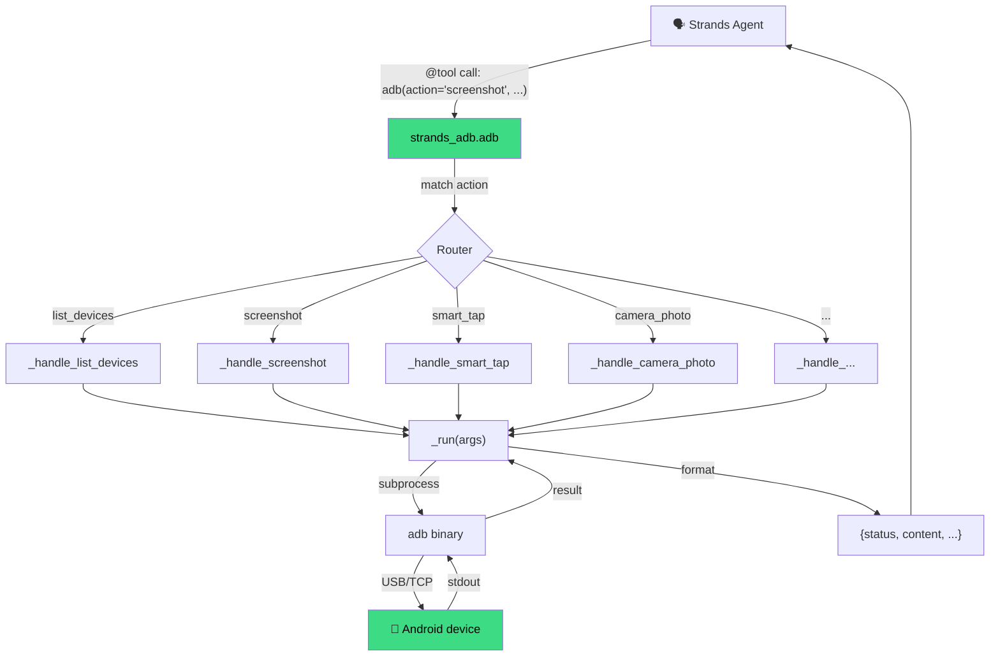
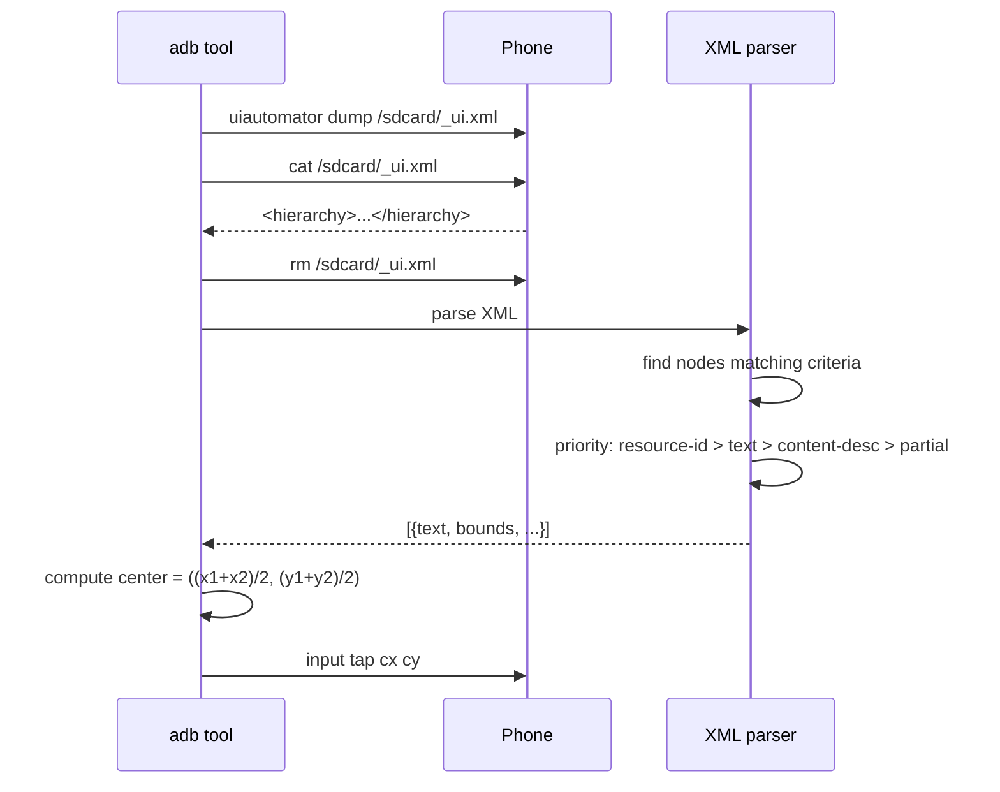
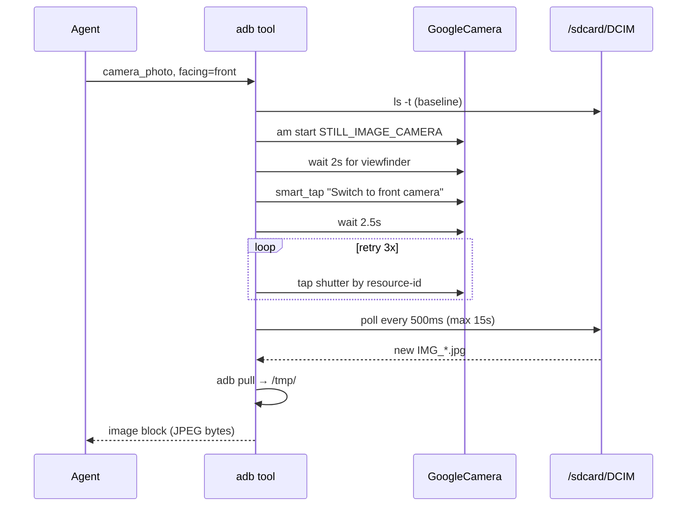
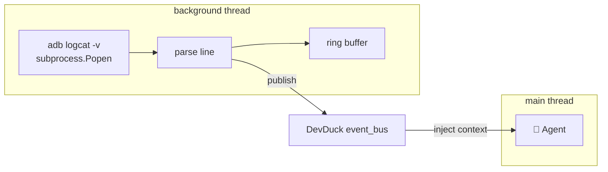

# Architecture

How `strands-adb` is structured internally.

---

## Package Structure

```
strands_adb/
├── __init__.py                  # exports: adb
├── adb_tool.py                  # main @tool dispatch (90+ actions)
└── smart.py                     # smart_tap + UI helpers (XML parsing,
                                 # resource-id / content-desc matching)
```

One tool, one dispatch function, action-specific handlers.

## The Dispatch Pattern



## Tool Surface

One `@tool` decorated function exposes all 90+ actions:

```python
@tool
def adb(
    action: str,
    # Device targeting
    serial: Optional[str] = None,
    # Generic params
    x: int = None, y: int = None, text: str = None,
    package: str = None, url: str = None,
    # Screenshot / camera
    output_path: str = None, include_image: bool = True,
    # UI automation
    resource_id: str = None, content_desc: str = None,
    # Sensors / settings
    namespace: str = None, key: str = None, value: str = None,
    # ... (see api-reference.md for full list)
):
    """Android device control via adb."""
    ...
```

The LLM sees one tool with a clearly-documented action enum. Parameters are only required when their respective action needs them.

## The `_run` Core

Every action eventually calls:

```python
def _run(args: List[str], serial=None, timeout=30):
    cmd = [_adb_bin()]
    if serial or _SELECTED_SERIAL:
        cmd += ["-s", serial or _SELECTED_SERIAL]
    cmd += args
    proc = subprocess.run(cmd, capture_output=True, text=True, timeout=timeout)
    return {"stdout": ..., "stderr": ..., "returncode": ...}
```

- Serial selection priority: explicit arg → `_SELECTED_SERIAL` → `$ADB_SERIAL` → first available device
- Timeout defaults to 30s (configurable)
- Binary path via `$ADB_BIN` env

## The Converse API Bridge

Screenshot + camera actions return a content block compatible with AWS Converse API:

```python
{
    "status": "success",
    "content": [
        {"text": "screenshot saved: /tmp/...png (284512 bytes)"},
        {"image": {"format": "png", "source": {"bytes": b"\x89PNG..."}}},
    ],
    "path": "/tmp/...png",
    "size_bytes": 284512,
}
```

Strands Agent passes this straight into the vision model's context. Same format as `strands_tools.image_reader`.

## Smart Tap Pipeline

`smart.py` handles semantic UI lookup:



## Camera Flow



## Logcat Streaming



- Streaming is opt-in (`log_stream_start`)
- Line-buffered subprocess
- Parsed into structured events
- Ring buffer (default N=500)
- Each line → published to `phone.logcat` (or custom topic) on the event bus

## Environment Variables

| Variable | Purpose | Default |
|----------|---------|---------|
| `ADB_BIN` | Path to `adb` binary | `adb` (PATH) |
| `ADB_SERIAL` | Default device serial | none |
| (none others required) | | |

## Error Handling

Every handler returns:

```python
# Success
{"status": "success", "content": [{"text": "..."}], ...}

# Error
{"status": "error", "content": [{"text": "descriptive error"}]}
```

Exceptions caught + converted. `ADBError` raised internally for clarity, then caught at tool boundary.

## Testing

```
tests/
├── test_adb.py                 # action-level integration tests
├── test_smart.py               # smart_tap / UI matching
├── test_camera.py              # physical camera (requires device)
└── conftest.py                 # fixtures: mock + real device
```

11/11 tests passing on Pixel 10 Pro (Android 16).

```bash
python tests/test_adb.py
```

## Extending

Adding a new action:

1. Add `_handle_foo(...)` in `adb_tool.py`
2. Add `elif action == "foo":` branch in the dispatch
3. Document parameters in the `@tool` docstring
4. Add a test in `tests/test_adb.py`

That's it — no other wiring needed. The LLM will pick it up automatically once it's in the action list.

## What's Next

- [**API Reference**](api-reference.md) — every action's parameters
- [**FRONTIERS.md**](https://github.com/cagataycali/strands-adb/blob/main/FRONTIERS.md) — open roadmap
- [**Contributing**](https://github.com/cagataycali/strands-adb/blob/main/README.md) — how to add your own actions
