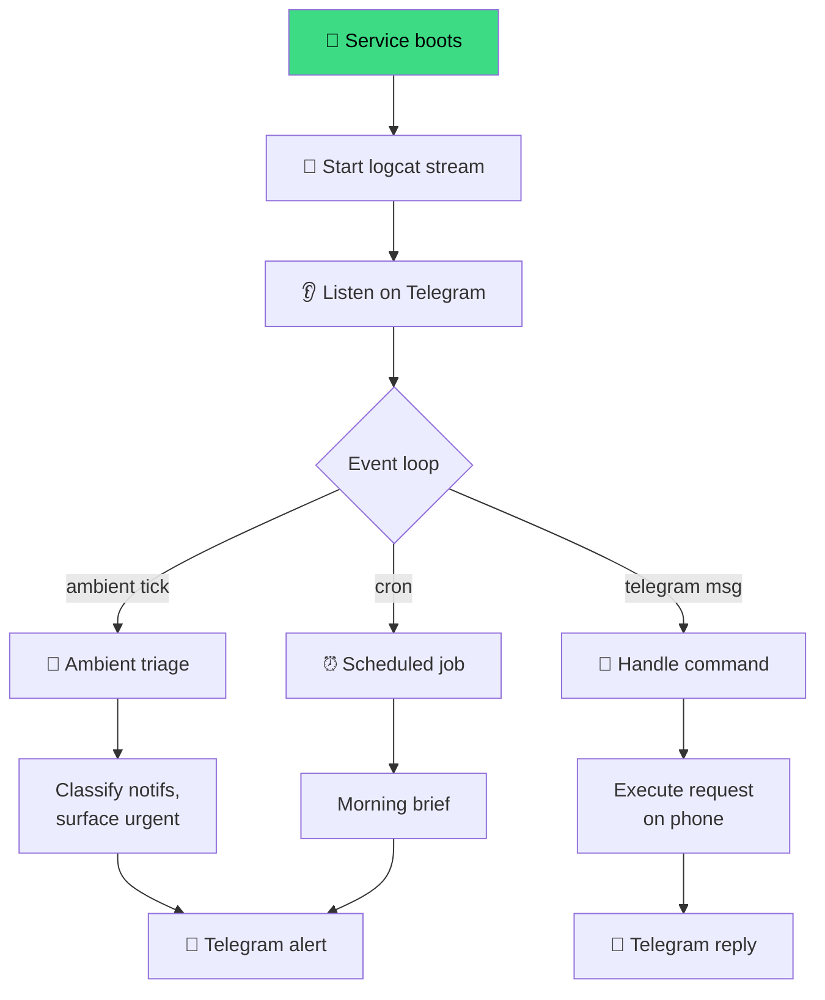

# Example: Autonomous Phone Agent

A phone agent that runs 24/7 via DevDuck. Monitors notifications, responds to Telegram commands, optimizes device state, wakes you up.

---

## The Full Setup

```bash
# 1. Environment
export MODEL_PROVIDER=bedrock
export STRANDS_MODEL_ID="global.anthropic.claude-sonnet-4"
export AWS_BEARER_TOKEN_BEDROCK=xxx

export ADB_SERIAL="192.168.1.42:5555"           # wireless phone
export TELEGRAM_BOT_TOKEN=xxx                   # for remote control
export DEVDUCK_AMBIENT_MODE=true
export DEVDUCK_AMBIENT_IDLE_SECONDS=60

export DEVDUCK_TOOLS="strands_adb:adb;strands_tools:shell,file_read,file_write,use_agent;devduck.tools:tasks,scheduler,ambient_mode,notify,telegram,system_prompt,identity"

# 2. Install as a service
devduck service install \
  --name phone-agent \
  --model "global.anthropic.claude-sonnet-4" \
  --startup-prompt "start logcat stream for notifications, then wait for telegram commands and ambient triage" \
  --env ADB_SERIAL=192.168.1.42:5555 \
  --env TELEGRAM_BOT_TOKEN=$TELEGRAM_BOT_TOKEN \
  --env AWS_BEARER_TOKEN_BEDROCK=$AWS_BEARER_TOKEN_BEDROCK
```

Now `phone-agent` runs in the background, auto-restarts on failure, starts on boot.

## What It Does



## Scheduled Jobs

Once the service is running, add recurring jobs:

```python
scheduler(action="add",
  name="morning-brief",
  schedule="0 8 * * *",
  prompt="read notifications from last 12h, send telegram brief")

scheduler(action="add",
  name="thermal-check",
  schedule="*/5 * * * *",
  prompt="check thermals; if CPU > 80°C reduce brightness")

scheduler(action="add",
  name="battery-watch",
  schedule="*/15 * * * *",
  prompt="check battery; if <15% and not charging, telegram warn me")
```

## Telegram Commands

With `devduck.tools:telegram` in your `DEVDUCK_TOOLS`, the agent listens for messages. Send from your phone:

- `status` → device info, battery, thermals, current app
- `screenshot` → agent takes a screenshot + sends image back
- `open spotify` → launches Spotify
- `read last mom msg` → reads WhatsApp
- `airplane mode` → enables it
- `where's the phone?` → last known location / on-desk / in-pocket

The agent interprets freely because it has the full `adb` toolbelt.

## Identity for Multiple Phones

If you control multiple devices, create identities:

```python
identity(action="create",
  name="pixel-main",
  system_prompt="You manage the main Pixel phone at 192.168.1.42",
  env_vars='{"ADB_SERIAL": "192.168.1.42:5555"}',
  tools_config="strands_adb:adb;strands_tools:shell",
  model_id="global.anthropic.claude-sonnet-4")

identity(action="create",
  name="tablet-couch",
  system_prompt="You manage the Samsung tablet in the living room",
  env_vars='{"ADB_SERIAL": "10.0.0.50:5555"}',
  tools_config="strands_adb:adb;strands_tools:shell",
  model_id="global.anthropic.claude-sonnet-4")

# Fan out
identity(action="fan_out", system_knowledge='''[
  {"identity": "pixel-main",  "task": "check notifications"},
  {"identity": "tablet-couch", "task": "keep brightness adaptive"}
]''')
```

Now one DevDuck instance orchestrates multiple phones.

## Autonomous Mode

For self-directed work — the agent plans and executes until a task is truly done:

```bash
devduck
🦆 auto
🦆 investigate: my phone drops wifi every hour around 9pm. diagnose.
```

Agent will:

1. Read `wifi_info` now + in loop
2. Check logcat for wifi errors
3. Hypothesize (router? range? interference?)
4. Toggle settings to test
5. Report findings

→ [DevDuck autonomous mode](https://cagataycali.github.io/devduck/guide/ambient-mode/)

## Monitoring the Agent

```bash
devduck service logs --name phone-agent --follow
devduck service status --name phone-agent
```

## Full Shell Wrapper

```bash
#!/bin/bash
# ~/bin/phone-agent
set -a
source ~/.phone-agent.env
set +a

devduck "$@"
```

```bash
# ~/.phone-agent.env
MODEL_PROVIDER=bedrock
STRANDS_MODEL_ID="global.anthropic.claude-sonnet-4"
AWS_BEARER_TOKEN_BEDROCK=xxx
ADB_SERIAL=192.168.1.42:5555
TELEGRAM_BOT_TOKEN=xxx
DEVDUCK_AMBIENT_MODE=true
DEVDUCK_TOOLS="strands_adb:adb;strands_tools:shell,file_read,file_write;devduck.tools:tasks,scheduler,ambient_mode,notify,telegram,system_prompt"
```

```bash
phone-agent "status"
phone-agent "take a screenshot"
phone-agent        # interactive
```

## What's Next

- [**DevDuck integration**](../guide/devduck.md) — runtime internals
- [**Safety guide**](../guide/safety.md) — harden a 24/7 agent
- [**API Reference**](../api-reference.md) — every action available
