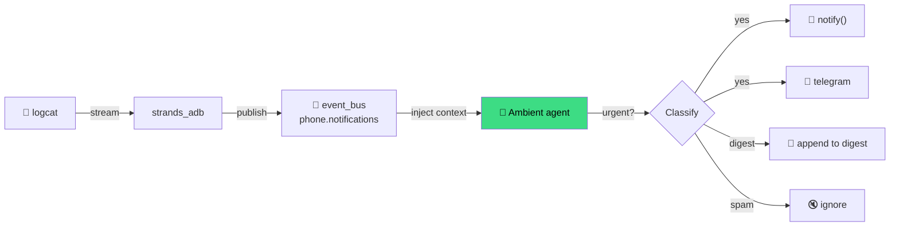

# Example: Notification Triage

Stream notifications from the phone. Agent decides which are urgent, surfaces them.

---

## What It Does

1. Start a background logcat stream filtering for `NotificationManagerService`
2. DevDuck's event bus receives every new notification
3. Agent periodically (or ambient-mode) reviews buffered events
4. For important ones → `notify()` to macOS / Telegram / speak
5. Dismiss trivial ones

## Setup

```bash
export DEVDUCK_TOOLS="strands_adb:adb;strands_tools:shell;devduck.tools:notify,telegram,ambient_mode,scheduler"
export DEVDUCK_AMBIENT_MODE=true
export TELEGRAM_BOT_TOKEN=xxx
```

## Start the Stream

```python
# On first DevDuck prompt:
🦆 start logcat stream for notifications, filter NotificationManagerService
```

This calls under the hood:

```python
adb(action="log_stream_start",
    filter="NotificationManagerService",
    topic="phone.notifications")
```

## Ambient Triage

With `DEVDUCK_AMBIENT_MODE=true`, the agent wakes up every minute of idle:

```python
# Prompt (set via system_prompt or initial query):
🦆 every time you wake, check the event bus for phone.notifications.
   for each notification:
     - if from Mom/Dad/Partner → notify me via Telegram + macOS
     - if from Slack or email → add to a daily digest
     - if spam (promo, system, ads) → ignore
```



## Morning Brief via `scheduler`

```python
scheduler(action="add",
  name="morning-brief",
  schedule="0 8 * * *",
  prompt="""
  read phone.notifications events from the last 12 hours.
  write a morning brief: who tried to reach me, what was urgent,
  what's my todo list based on these messages.
  notify me via Telegram.
  """,
  tools="strands_adb.adb,devduck.tools.telegram,devduck.tools.notify")
```

## One-Shot Variant (no streaming)

Don't want background streams? Just poll:

```python
agent("""
dump current notifications via notifications_parsed.
surface anything from Mom/Dad/Partner that's unread.
""")
```

## Dismissing

```python
adb(action="dismiss_notifications")    # dismiss all
adb(action="key", key="KEYCODE_ESCAPE") # dismiss the shade
```

## Full Example Script

```python
# examples/notifications.py
from strands import Agent
from strands_adb import adb

agent = Agent(
    tools=[adb],
    system_prompt="""
You are a notification triage agent.
- Use notifications_parsed to see structured notifications.
- Classify: URGENT (family/partner), IMPORTANT (work), DIGEST, SPAM.
- For URGENT: return a clear summary.
- For SPAM: suggest dismiss.
""",
)

while True:
    result = agent("check current notifications, triage them")
    print(result)
    input("\nPress enter to check again...")
```

## Privacy

Logcat exposes notification content including message previews. Treat accordingly:

- Filter aggressively (`NotificationManagerService` only)
- Redact sensitive fields before logging
- Don't push raw notification content to third-party APIs without thinking

→ See [Safety guide](../guide/safety.md).

## What's Next

- [**WhatsApp Assistant**](whatsapp.md) — direct messaging flow
- [**Autonomous Agent**](autonomous.md) — full 24/7 setup
- [**Logcat guide**](../guide/logcat.md) — streaming internals
