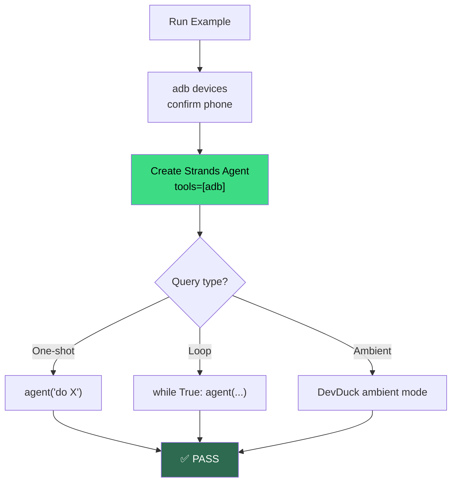

# Examples

Runnable agent flows you can copy-paste.

---

## All Examples

<div class="grid cards" markdown>

- **💬 WhatsApp Assistant**

    Read last message from a contact, draft a reply, send (with confirmation).

    → [Full example + code](whatsapp.md)

- **🔔 Notification Triage**

    Stream notifications via logcat, agent decides which to surface.

    → [Full example + code](notifications.md)

- **👁️ Screen Reader**

    Describe what's on screen, continuously — accessibility for sighted automation.

    → [Full example + code](screen-reader.md)

- **🤖 Autonomous Phone Agent**

    DevDuck ambient mode: self-directed phone assistant running 24/7.

    → [Full example + code](autonomous.md)

</div>

---

## Running Locally

```bash
git clone https://github.com/cagataycali/strands-adb.git
cd strands-adb
pip install -e .

# Ensure adb + a device
adb devices

# Run any example
python examples/whatsapp.py
python examples/notifications.py
python examples/screen_reader.py
python examples/autonomous.py
```

!!! note "Set your model"
    All examples use [Strands Agents](https://strandsagents.com). Default model is auto-detected from env vars:
    ```bash
    # Bedrock
    export AWS_BEARER_TOKEN_BEDROCK=xxx

    # OpenAI
    export OPENAI_API_KEY=xxx

    # Anthropic
    export ANTHROPIC_API_KEY=xxx
    ```

---

## Execution Flow



---

## Quick Reference

| # | Example | Actions used | Key concept |
|---|---------|-------------|-------------|
| 1 | [WhatsApp Assistant](whatsapp.md) | `launch`, `screenshot`, `smart_tap`, `type_text` | End-to-end UI flow |
| 2 | [Notification Triage](notifications.md) | `log_stream_start`, `notifications_parsed` | Event-driven agents |
| 3 | [Screen Reader](screen-reader.md) | `screenshot`, ambient loop | Continuous vision |
| 4 | [Autonomous Phone Agent](autonomous.md) | Everything | Full DevDuck setup |
