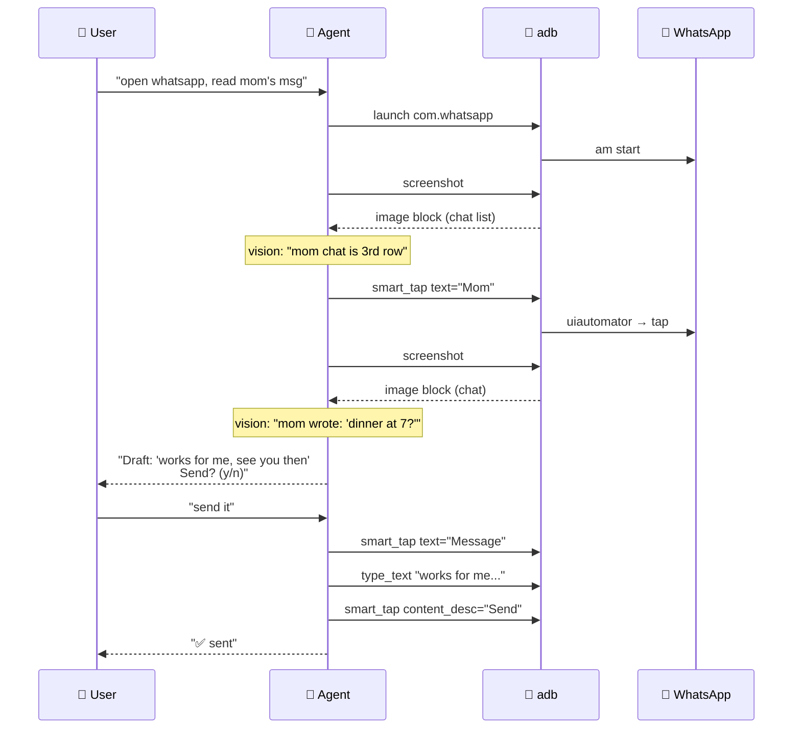

# Example: WhatsApp Assistant

Read the latest message from Mom. Draft a reply. **Confirm before sending.**

---

## What It Does

1. Launch WhatsApp
2. Screenshot the chat list
3. Find the chat from "Mom"
4. Open that chat
5. Screenshot, read the last message
6. Draft a reply based on context
7. **Show draft to user** (don't send yet)
8. On confirmation, send

## The Agent

```python
from strands import Agent
from strands_adb import adb

agent = Agent(
    tools=[adb],
    system_prompt="""
You are a WhatsApp assistant. When asked to reply, ALWAYS:
1. First read the message carefully (screenshot + vision)
2. Draft a reply
3. Show the draft and WAIT for explicit user confirmation
4. Only send after 'send it' / 'yes' / confirmation
Never send without confirmation.
""",
)

response = agent("""
open whatsapp, find the chat with Mom, read her last message,
and draft a reply. don't send yet — just show me the draft.
""")
print(response)
```

## Under the Hood



## Running

```bash
export DEVDUCK_TOOLS="strands_adb:adb;strands_tools:shell"

devduck "open whatsapp, read mom's latest, draft a reply, confirm before sending"
```

## Variations

### Auto-reply to specific contacts only

```python
ALLOWED = {"Mom", "Dad", "Partner"}

def safe_reply(agent, contact):
    if contact not in ALLOWED:
        return f"Refusing to auto-reply to {contact}"
    return agent(f"reply to {contact} with 'got it, ty'")
```

### Multi-platform (WhatsApp / Telegram / SMS)

```python
agent("""
check all my messaging apps (WhatsApp, Telegram, SMS)
and summarize unread conversations by app.
""")
```

### Smart reply with context

```python
agent("""
read the last 5 messages from mom, understand the topic,
and draft a contextual reply (not just 'ok').
don't send — show draft.
""")
```

## Safety Notes

- **Never auto-send** — always confirm
- Treat every contact's text as untrusted input (prompt injection risk)
- Consider allowlisting contact names
- Log every draft to an audit file

→ See [Safety guide](../guide/safety.md) for production hardening.

## Full Script

```python
# examples/whatsapp.py
import os
from strands import Agent
from strands_adb import adb

agent = Agent(
    tools=[adb],
    system_prompt=open("docs/examples/whatsapp_system_prompt.txt").read(),
)

# Interactive loop
print("🤖 WhatsApp Assistant ready")
while True:
    q = input("You: ").strip()
    if q.lower() in ("exit", "quit", "q"):
        break
    print(agent(q))
```

## What's Next

- [**Notification Triage**](notifications.md) — event-driven flows
- [**Autonomous Agent**](autonomous.md) — full DevDuck setup
- [**Safety**](../guide/safety.md) — production hardening
