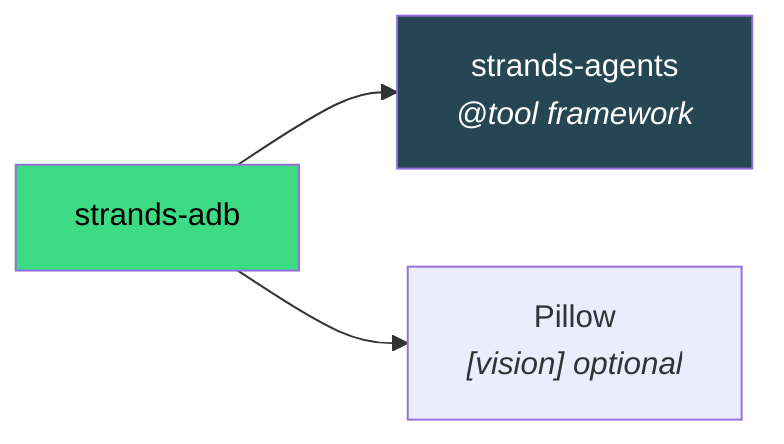

# Installation

## Requirements

- Python ≥ 3.10
- [`adb`](https://developer.android.com/tools/adb) on PATH
- An Android device (phone/tablet) or emulator with **USB debugging enabled**

## Install `strands-adb`

```bash
pip install strands-adb
```

!!! tip "zsh users"
    If you see `zsh: no matches found`, quote the package name: `pip install "strands-adb"`

!!! note "Editable / from source"
    ```bash
    git clone https://github.com/cagataycali/strands-adb.git
    cd strands-adb
    pip install -e .
    ```

## Install `adb`

=== "macOS"
    ```bash
    brew install android-platform-tools
    adb version
    ```

=== "Linux (Debian/Ubuntu)"
    ```bash
    sudo apt install android-tools-adb
    adb version
    ```

=== "Linux (Arch)"
    ```bash
    sudo pacman -S android-tools
    adb version
    ```

=== "Windows"
    ```powershell
    winget install Google.PlatformTools
    adb version
    ```

## Enable USB Debugging on the Phone

1. **Settings → About phone** → tap **Build number** 7 times
2. **Settings → System → Developer options** → enable **USB debugging**
3. Plug in USB. Accept the trust prompt that pops up on the device.

```bash
adb devices
# List of devices attached
# 59230DLCH0012Z  device
```

→ [Connect a Device](connect.md) covers USB, wireless, and SSH-over-adb setup in depth.

## Verify

```python
from strands import Agent
from strands_adb import adb

agent = Agent(tools=[adb])
print(agent("list connected adb devices"))
```

You should see the device serial. ✅

## Optional: Companion Install Script

The repo ships an interactive installer that handles `adb install` of helper APKs + USB debugging guidance:

```bash
curl -fsSL https://raw.githubusercontent.com/cagataycali/strands-adb/main/install_android.sh | bash
```

→ Details: [`INSTALL_ANDROID.md`](https://github.com/cagataycali/strands-adb/blob/main/INSTALL_ANDROID.md)

## Platform Compatibility

| Platform | adb | Status |
|----------|-----|--------|
| macOS (Apple Silicon / Intel) | ✅ | Primary dev target |
| Linux x86_64 | ✅ | Fully supported |
| Linux ARM64 (incl. Jetson) | ✅ | Works great for edge agents |
| Windows 10/11 | ✅ | Works, USB driver setup required |
| Android device running adb | ✅ | Via Termux → adb over TCP |

## What Gets Installed



## What's Next

- [**Quickstart**](quickstart.md) — Your first adb-enabled agent in 5 lines
- [**Connect a Device**](connect.md) — USB, wireless, SSH over adb
- [**DevDuck Integration**](../guide/devduck.md) — Zero-config drop-in
