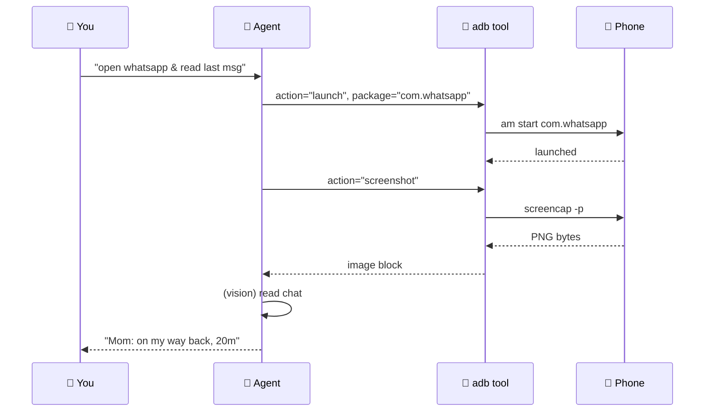
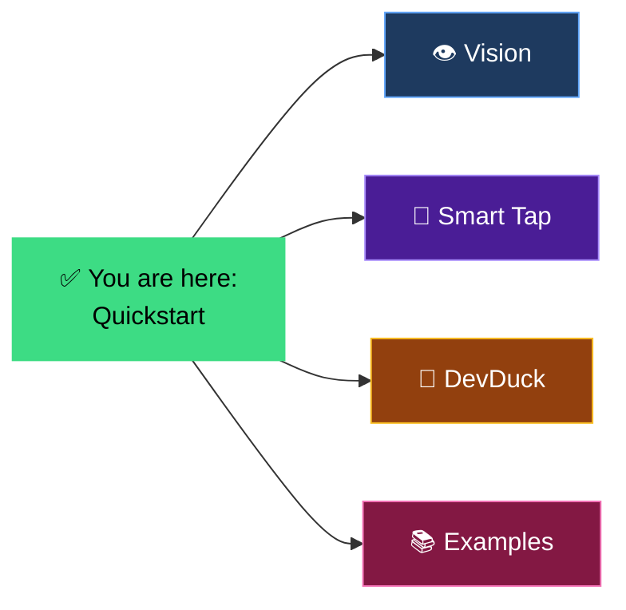

# Quickstart

From zero to a phone-controlling agent in under 2 minutes.

---

## The Journey


## 1. Install

```bash
pip install strands-adb
brew install android-platform-tools   # or apt / pacman / winget
```

## 2. Connect

```bash
adb devices
# 59230DLCH0012Z  device
```

If you see `unauthorized`, accept the trust dialog on the phone.

## 3. Hello, Phone

```python
from strands import Agent
from strands_adb import adb

agent = Agent(tools=[adb])
agent("what's on my phone screen right now?")
```

The agent will:

1. Call `adb(action="screenshot")`
2. Receive a PNG image block (it can literally **see**)
3. Describe what's on screen

## 4. Drive the UI

```python
agent("open whatsapp and tell me the last message")
```

Under the hood:



## 5. Common One-Liners

```python
# Reality check
agent("take a photo with the front camera and describe me")

# Device state
agent("how's my battery? any thermal warnings?")

# Notifications
agent("read me my current notifications")

# Launch app
agent("open spotify and tell me what's playing")

# UI automation
agent("tap the button that says 'Send'")

# Settings mutation
agent("enable airplane mode, I'm about to board")

# Sensors
agent("is the phone face-down right now?")
```

## 6. DevDuck (Recommended)

[DevDuck](https://dev.duck.nyc) is the minimalist agent runtime. With one env var, `adb` becomes a first-class tool:

```bash
export DEVDUCK_TOOLS="strands_adb:adb;strands_tools:shell"
devduck "text mom 'on my way' via whatsapp"
```

→ [DevDuck integration guide](../guide/devduck.md)

## 7. Multi-Device

Target a specific device when you have several connected:

```python
agent("take a screenshot of device 59230DLCH0012Z")

# Or set a default:
import os
os.environ["ADB_SERIAL"] = "59230DLCH0012Z"
```

→ See [Connect a Device](connect.md) for wireless / SSH / multi-device setups.

---

## What's Next



- [**Vision / Screenshots**](../guide/vision.md) — how the agent actually sees
- [**Smart Tap**](../guide/smart-tap.md) — semantic UI automation
- [**DevDuck Integration**](../guide/devduck.md) — 1-line agent runtime
- [**Examples**](../examples/overview.md) — WhatsApp, notifications, autonomous
