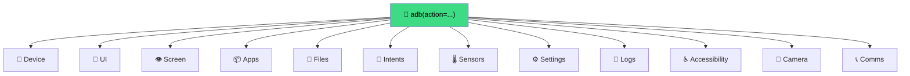

# Actions Overview

`strands-adb` exposes **one tool**: `adb`. It dispatches on a single `action="..."` argument. There are 90+ actions grouped into domains.

```python
from strands_adb import adb

adb(action="screenshot")
adb(action="smart_tap", text="Send")
adb(action="battery")
```

---

## Action Groups



## 📱 Device

| Action | Purpose |
|--------|---------|
| `list_devices` | Enumerate connected devices |
| `select_device` | Set default device serial |
| `device_info` | Model, manufacturer, Android version |
| `battery` | `dumpsys battery` |
| `wake` | Wake screen |
| `unlock` | Wake + swipe + optional PIN |

## 🎯 UI Input

| Action | Purpose |
|--------|---------|
| `tap` | Tap at `(x, y)` |
| `swipe` | Swipe between two points over duration |
| `type_text` | Type text into focused field |
| `key` | Send keyevent (back, home, enter, volume_up, ...) |
| `back` / `home` / `recent` | Convenience keyevents |
| `gesture_long_press` | Long press at `(x, y)` |
| `gesture_path` | Multi-point gesture sequence |
| `gesture_pinch` | Pinch-to-zoom |
| `gesture_stream` | Stream of gestures |

## 👁️ Screen & UI Inspection

| Action | Purpose |
|--------|---------|
| `screenshot` | Capture PNG + return as Converse image block |
| `screen_record` | Blocking fixed-duration recording |
| `screen_record_start` / `_stop` / `_status` | **Background recording** — record while agent acts |
| `screen_frames` | Extract N live screenshots at intervals |
| `video_frames` | Extract frames from an on-device video |
| `ui_dump` | Raw UIAutomator XML |
| `ui_find` | Find UI node by text / resource-id / content-desc |
| `ui_tap_by` | Tap a node found by `ui_find` criteria |
| `ui_wait_for` | Poll until a node appears |
| `smart_tap` | High-level: tap by semantic text |

→ [Vision guide](vision.md) · [Smart tap guide](smart-tap.md) · [UI automation](ui-automation.md)

## 📦 Apps

| Action | Purpose |
|--------|---------|
| `list_packages` | List installed apps |
| `launch` | `am start` a package |
| `kill` | Force-stop a package |
| `install` | `adb install` an APK |
| `uninstall` | Uninstall a package |
| `clear_data` | Clear app data |
| `current_app` | What's in the foreground |

→ [Apps & Intents guide](apps-intents.md)

## 📂 Files

| Action | Purpose |
|--------|---------|
| `push` | Host → device |
| `pull` | Device → host |
| `ls` | List remote directory |

## 🔗 Intents

| Action | Purpose |
|--------|---------|
| `open_url` | `am start -a VIEW -d URL` |
| `share_text` | Android share sheet |
| `start_activity` | Arbitrary `am start` with args |

## 🌡️ Sensors & Thermals

| Action | Purpose |
|--------|---------|
| `sensors` | Accelerometer, gyro, light, etc. |
| `thermals` | CPU / skin / battery temps |
| `wifi_info` | SSID, BSSID, signal |

→ [Sensors guide](sensors.md)

## ⚙️ Settings Mutation

| Action | Purpose |
|--------|---------|
| `setting_get` / `setting_put` / `setting_delete` / `setting_list` | Raw namespace-scoped settings |
| `set_ringer` | silent / vibrate / normal |
| `set_brightness` | 0–255 |
| `set_bluetooth` | enable/disable |
| `set_airplane_mode` | enable/disable |
| `setting_dump` | Dump all settings in a namespace |

→ [Settings guide](settings.md)

## 📜 Logs

| Action | Purpose |
|--------|---------|
| `logcat` | One-shot `logcat -d` |
| `log_stream_start` / `stop` / `status` | Background streaming → DevDuck event bus |
| `notifications` / `notifications_parsed` | Dump notifications (raw / structured) |

→ [Logcat streaming guide](logcat.md)

## ♿ Accessibility

| Action | Purpose |
|--------|---------|
| `accessibility_list` | List available services |
| `accessibility_toggle_service` | Enable/disable a service |
| `accessibility_system_action` | Trigger a system action |
| `accessibility_captions` | Toggle live captions |
| `accessibility_magnification` | Enable screen magnification |
| `accessibility_font_scale` | Set font size multiplier |
| `accessibility_status` | Overall a11y state |

→ [Accessibility guide](accessibility.md)

## 📸 Camera

| Action | Purpose |
|--------|---------|
| `camera_photo` | Take a still photo (returns image block) |
| `camera_video` | Record a video |

→ [Camera guide](camera.md)

## 📞 Comms

| Action | Purpose |
|--------|---------|
| `dial` | Open dialer with number (or auto-call) |
| `sms_compose` | Draft an SMS |
| `media_control` | play/pause/next/prev/stop |
| `volume` | Raise/lower/mute |

## Response Shape

Every action returns:

```python
{
    "status": "success" | "error",
    "content": [
        {"text": "human-readable summary"},
        # optionally, for screenshots / camera:
        {"image": {"format": "png", "source": {"bytes": b"..."}}},
    ],
    # action-specific extras:
    "path": "/tmp/foo.png",
    "devices": [...],
    "info": {...},
}
```

The `content` field follows the [AWS Converse API content block format](https://docs.aws.amazon.com/bedrock/latest/userguide/conversation-inference.html), which Strands Agent consumes directly.

## What's Next

- [**Vision**](vision.md) — screenshots as image blocks
- [**Smart Tap**](smart-tap.md) — semantic UI automation
- [**DevDuck**](devduck.md) — production agent runtime
- [**API Reference**](../api-reference.md) — full action signatures
