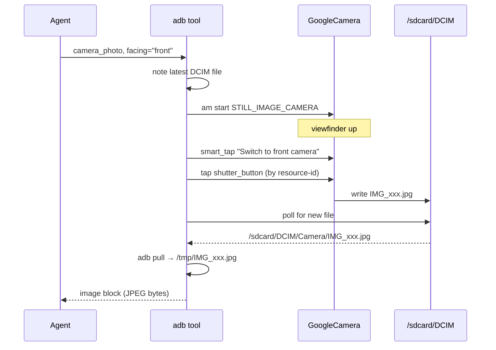

# Camera — Physical Photos & Video

Drive the actual camera. Not screenshots — real photos from the lens.

```python
adb(action="camera_photo", facing="back")
adb(action="camera_photo", facing="front")
adb(action="camera_video", facing="back", duration_sec=10)
```

Returns the captured media as a Converse API image/video block, so the agent can immediately see what it just captured.

---

## How It Works



## Parameters

| Param | Default | Notes |
|-------|---------|-------|
| `facing` | `"back"` | `"back"` or `"front"` |
| `output_path` | `/tmp/<original>.jpg` | Where to pull the file |
| `auto_pull` | `True` | Pull to host after capture |
| `include_image` | `True` | Embed image block in response |
| `return_base64` | `False` | Also include base64 |
| `timeout_sec` | `15` | Max wait for file to appear (Night Sight needs ~5s) |

## Strategy: Why GoogleCamera?

Most phones have multiple camera apps. We target **GoogleCamera** specifically because:

- Its shutter button has a stable `resource-id`: `com.google.android.GoogleCamera:id/shutter_button`
- Google doesn't rename it across versions
- Available on all Pixel / most Android-12+ devices

For other camera apps, adapt via `resource_id` parameter.

## Night Sight / Portrait / Other Modes

`camera_photo` currently uses whatever mode GoogleCamera was last in. To force a mode, smart_tap it first:

```python
adb(action="launch", package="com.google.android.GoogleCamera")
adb(action="smart_tap", text="Night Sight")
adb(action="camera_photo", facing="back")  # captures in Night Sight
```

## Video

```python
result = adb(action="camera_video", duration_sec=15, facing="back")
# result["path"] → /tmp/VID_xxx.mp4
```

For longer-form recording, use `screen_record` instead (records the screen, not camera).

## Agent Recipes

### "Take a selfie and tell me how I look"

```python
agent("take a front-facing photo and describe what you see")
# 1. camera_photo facing=front
# 2. vision model sees the photo
# 3. agent describes it
```

### "Document what's in front of me"

```python
agent("take a back-camera photo and identify any objects")
```

### "Is my desk tidy?"

```python
agent("take a photo and rate my desk tidiness 1-10")
```

## Pitfalls

| Problem | Fix |
|---------|-----|
| Photo never appears (timeout) | Night Sight in low light can take 5-8s — increase `timeout_sec` |
| Wrong camera faces you | Pass `facing="front"` / `"back"` explicitly |
| Shutter never fires | Camera UI still animating — we retry 3× by default |
| Photo ends up blurry | Phone moved during capture — use a stand |
| Permission denied reading DCIM | Verify `adb shell ls /sdcard/DCIM/Camera` works |

## What's Next

- [**Vision**](vision.md) — difference between screenshots and camera
- [**Sensors**](sensors.md) — ambient light, gyro (auto-select mode)
- [**Smart Tap**](smart-tap.md) — how we find the shutter button
