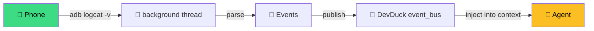

# Logcat — Event Streaming

`logcat` is Android's system-wide event log. Every notification, every app error, every broadcast — all streamed from the kernel in real time. `strands-adb` turns this into agent-consumable events.

---

## One-Shot Dump

```python
result = adb(action="logcat", lines=200)
# → last 200 lines of logcat -d
```

Filter by tag:

```python
adb(action="logcat", filter="WhatsApp", lines=100)
adb(action="logcat", filter="NotificationManagerService:V *:S")
```

## Continuous Streaming → Event Bus

This is the killer feature. Start a background thread that tails logcat and pushes events to DevDuck's [event bus](https://github.com/cagataycali/devduck):

```python
adb(action="log_stream_start",
    filter="NotificationManagerService",
    topic="phone.notification")
```

Now, inside DevDuck, the event bus receives a new event every time a notification is posted. The agent's context is automatically updated.

```python
# Check stream status
adb(action="log_stream_status")
# → running=True, buffered=47 events, started 3m ago

# Stop
adb(action="log_stream_stop")
```



## Parsed Notifications

Raw logcat is noisy. For notifications specifically, use the parsed action:

```python
adb(action="notifications_parsed")
# → [
#   {"app": "WhatsApp", "title": "Mom", "text": "on my way", "time": ...},
#   {"app": "Slack", "title": "#general", "text": "PR ready", "time": ...},
#   ...
# ]
```

Or raw dump:

```python
adb(action="notifications")
```

## Filters

Standard logcat filter syntax works:

```python
adb(action="log_stream_start",
    filter="ActivityManager:I NotificationManagerService:V *:S")
# → Show INFO+ from ActivityManager, VERBOSE+ from NotificationManager, silence everything else
```

## Agent Recipes

### Notification triage

```python
adb(action="log_stream_start",
    filter="NotificationManagerService",
    topic="phone.notifications")

# agent loop sees new notifications in context automatically
agent("""
any new important notifications? reply to mom if she messaged.
""")
```

### App crash monitoring

```python
adb(action="log_stream_start",
    filter="AndroidRuntime:E *:S",
    topic="phone.crashes")

# agent is notified of every app crash
```

### "What's been happening?"

```python
agent("""
what events have happened on my phone in the last 5 minutes?
summarize by app.
""")
```

## Performance

Streaming logcat is cheap — tens of events/sec, fits easily in memory. The background thread parses lines into structured events and buffers the last N (default 500) in memory, publishing each to the event bus.

## Privacy

Logcat contains **potentially sensitive data**: SMS previews, notification content, app state. Treat the event stream like you would any other sensitive telemetry:

- Don't log it to public places
- Filter aggressively (`filter=` narrows scope)
- Stop the stream when you're done

## What's Next

- [**DevDuck Integration**](devduck.md) — event bus details
- [**Sensors**](sensors.md) — combine logcat + sensor events
- [**Notification Triage example**](../examples/notifications.md) — full flow
