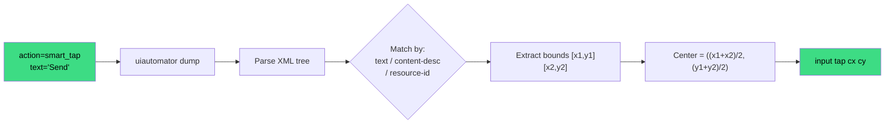
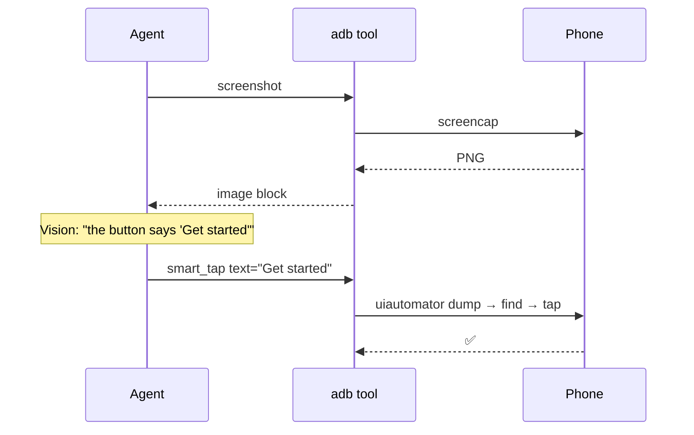

# Smart Tap — Semantic UI Automation

`smart_tap` is the "just do the thing" action. Give it text, it finds the UI element, taps it.

```python
adb(action="smart_tap", text="Send")
adb(action="smart_tap", text="Settings")
adb(action="smart_tap", content_desc="More options")
```

No pixel coordinates. No fragile hardcoded bounds. Works across Android versions, device sizes, and app updates.

---

## How It Works



## Matching Strategies

`smart_tap` tries multiple strategies in priority order:

| Priority | Strategy | Matches against |
|----------|----------|-----------------|
| 1 | Exact `text=` | Button labels, list items |
| 2 | Exact `content-desc=` | Accessibility labels (great for icon-only buttons) |
| 3 | Exact `resource-id=` | Developer-specified IDs (most stable) |
| 4 | Partial (contains) | Fallback when exact fails |

Pass whichever field you know:

```python
adb(action="smart_tap", text="Sign in")
adb(action="smart_tap", content_desc="Switch to front camera")
adb(action="smart_tap", resource_id="com.whatsapp:id/send")
```

## Real-World Recipes

### Tap WhatsApp send button

```python
adb(action="launch", package="com.whatsapp")
adb(action="smart_tap", text="Message")        # open a chat
adb(action="type_text", text="on my way")
adb(action="smart_tap", content_desc="Send")
```

### Dismiss a dialog

```python
adb(action="smart_tap", text="OK")
# or
adb(action="smart_tap", text="Dismiss")
```

### Camera shutter

```python
# The shutter is an icon-only button — text match won't work
adb(action="smart_tap",
    resource_id="com.google.android.GoogleCamera:id/shutter_button")
```

## Pairing with Vision

The most powerful pattern: **vision identifies what to tap, smart_tap does it**.

```python
agent("""
take a screenshot, identify any blue call-to-action button,
then smart_tap it by its label text
""")
```

Flow:



## Waiting for Elements

Dialogs appear asynchronously. Use `ui_wait_for`:

```python
# Wait up to 10s for the "Accept" button to appear
adb(action="ui_wait_for", text="Accept", timeout_sec=10)
adb(action="smart_tap", text="Accept")
```

## When `smart_tap` Fails

1. **Element in a WebView / Compose / Flutter** — may not expose via UIAutomator. Fall back to vision + `tap` with coordinates.
2. **Animation in progress** — add a small `time.sleep(0.5)` or `ui_wait_for`.
3. **Element scrolled off-screen** — scroll first (`swipe` up), then smart_tap.
4. **Duplicate matches** — use `resource_id` or `content_desc` for uniqueness.

Debug by dumping the tree:

```python
adb(action="ui_dump")
# Returns full XML — inspect what's actually there
```

## Lower-Level: `ui_find` + `ui_tap_by`

For complex criteria:

```python
# Find all nodes matching criteria
adb(action="ui_find", text="Reply", clickable=True)

# Tap by compound criteria
adb(action="ui_tap_by", text="Reply", index=0, clickable=True)
```

## What's Next

- [**UI Automation**](ui-automation.md) — raw `ui_find`, `ui_dump`, `ui_wait_for`
- [**Vision**](vision.md) — screenshot ↔ tap pairing
- [**Examples**](../examples/overview.md) — real flows end-to-end
