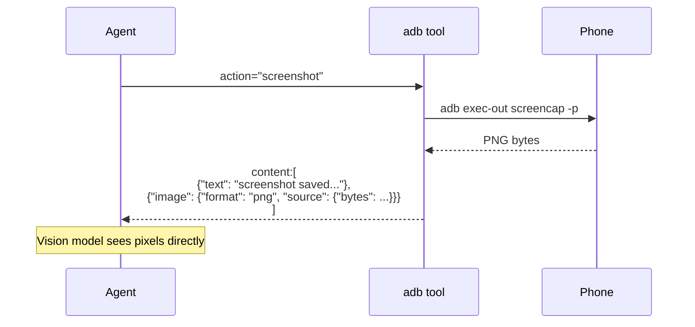

# Vision — Screenshots as Image Blocks

The single most important feature of `strands-adb` is this: **the agent can see the screen**.

Unlike naive adb wrappers that return a file path and force the LLM to "imagine" what's there, `screenshot` returns a proper [Converse API image block](https://docs.aws.amazon.com/bedrock/latest/userguide/conversation-inference.html) — the same shape that `strands_tools.image_reader` uses. The vision model receives the actual pixels.

---

## How It Works



## Usage

```python
from strands import Agent
from strands_adb import adb

agent = Agent(tools=[adb])
agent("take a screenshot and tell me what app is open")
```

Direct tool call:

```python
result = adb(action="screenshot")
# result["path"]         → "/tmp/adb_screenshot_1730000000.png"
# result["size_bytes"]   → 284512
# result["content"][0]   → {"text": "screenshot saved: /tmp/...png (284512 bytes)"}
# result["content"][1]   → {"image": {"format": "png", "source": {"bytes": b"\x89PNG..."}}}
```

## Parameters

| Param | Default | Notes |
|-------|---------|-------|
| `output_path` | `/tmp/adb_screenshot_<ts>.png` | Where to save the PNG locally |
| `serial` | `$ADB_SERIAL` | Target specific device |
| `include_image` | `True` | Embed Converse image block (disable to save context tokens) |
| `return_base64` | `False` | Also include base64 in response |

## Performance

Screenshot via `adb exec-out screencap -p` is the **fast path** — direct binary pipe, no intermediate file on device. Typical timings on a Pixel 10 Pro over USB:

| Method | Time |
|--------|------|
| `exec-out screencap -p` (default) | 180–350 ms |
| Fallback: shell screencap + adb pull | 700–1200 ms |

The fallback triggers automatically if `exec-out` fails (some devices have flaky `exec-out` support).

## When to Disable `include_image`

By default every screenshot pushes ~300 KB of PNG bytes into the context window. That's fine for a few calls, but if you're in a long-running ambient loop:

```python
# Just want the path, don't clutter context
adb(action="screenshot", include_image=False)
```

## Vision + UI Inspection

Screenshots pair beautifully with `ui_dump` for hybrid strategies:

```python
agent("""
take a screenshot, identify the WhatsApp compose button,
then tell me its bounds so we can tap it
""")
# Agent:
#   1. screenshot → sees the UI
#   2. ui_dump    → gets the XML with bounds
#   3. correlates → reports bounds of the button it just saw
```

For full automation use [`smart_tap`](smart-tap.md) which does all of this in one call.

## Wake First on Locked Screen

A locked screen screenshots to pure black. Wake + unlock first:

```python
adb(action="wake")
adb(action="unlock", pin="1234")
adb(action="screenshot")
```

Or just tell the agent:

```python
agent("wake up my phone and take a screenshot")
```

## Recording

For screen recording (not just stills), use `screen_record`:

```python
adb(action="screen_record", duration_sec=30, output_path="/tmp/session.mp4")
```

Or extract frames at N fps:

```python
adb(action="screen_frames", duration_sec=10, fps=2, output_dir="/tmp/frames/")
```

Each frame returns as an image block, perfect for video-capable models like [strands-cosmos](https://github.com/cagataycali/strands-cosmos).

## What's Next

- [**Smart Tap**](smart-tap.md) — one-shot semantic UI interaction
- [**UI Automation**](ui-automation.md) — `ui_find`, `ui_wait_for`, XML dumps
- [**Camera**](camera.md) — physical camera (not just screen)
