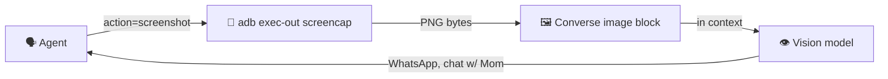

<div align="center">
  
  <h1>Strands ADB</h1>
  <p><strong>Give your agent a phone.</strong></p>
</div>

`@tool` decorated Android control for [Strands Agents](https://strandsagents.com) & [DevDuck](https://dev.duck.nyc) — drive any adb-connected Android device (phone, tablet, emulator) from an LLM.

---

## The Pitch

Your agent can already read files, call APIs, and run shell commands. Now it can also:

- **See the screen** (screenshots come back as Converse API image blocks, not paths)
- **Tap & swipe** — real UI automation
- **Read notifications, battery, sensors, thermals**
- **Launch apps, open URLs, send SMS drafts, make calls**
- **Take physical photos** (yes, through the actual camera)
- **Stream logcat** into your agent's event bus
- **Mutate settings** — brightness, ringer, airplane mode, bluetooth

One tool. One verb: `action=...`. Works over USB or wireless adb.

---

## 2-Minute Quickstart

```bash
pip install strands-adb
brew install android-platform-tools   # adb on PATH
adb devices                           # plug in phone, accept USB debugging
```

```python
from strands import Agent
from strands_adb import adb

agent = Agent(tools=[adb])
agent("take a screenshot of my phone and describe what's on screen")
```

→ **[Full Quickstart](getting-started/quickstart.md)** | **[Installation](getting-started/installation.md)** | **[Connect a Device](getting-started/connect.md)**

---

## 👁️ Agent Can SEE the Screen

`screenshot` returns a proper [Converse API image block](https://docs.aws.amazon.com/bedrock/latest/userguide/conversation-inference.html) — the same format as `strands_tools.image_reader`. The agent doesn't just get a file path, it actually **receives the pixels** and reasons over them.

```python
agent("take a screenshot and tell me what app is open")
# → adb(action="screenshot") returns PNG bytes in Converse image block
# → vision model reads it → "You're on the WhatsApp chat with Mom..."
```



---

## Capabilities

<div class="grid cards" markdown>

- **👁️ Vision**

    Screenshots as image blocks. Agent literally sees the screen.

    → [Vision guide](guide/vision.md)

- **🎯 Smart Tap**

    Find UI elements by text/content-desc, tap by semantic meaning.

    → [Smart tap](guide/smart-tap.md)

- **📸 Physical Camera**

    Drive GoogleCamera via intent + shutter — real photos, real video.

    → [Camera guide](guide/camera.md)

- **🔔 Notifications & Logcat**

    Parse notifications, stream logcat events to DevDuck's event bus.

    → [Logcat streaming](guide/logcat.md)

- **🌡️ Sensors & Thermals**

    Accelerometer, gyro, light, CPU temps — the phone as sensor platform.

    → [Sensors](guide/sensors.md)

- **⚙️ Settings Mutation**

    Ringer mode, brightness, airplane, bluetooth — programmatic device state.

    → [Settings](guide/settings.md)

- **♿ Accessibility**

    Read screen via accessibility service, magnification, captions.

    → [Accessibility](guide/accessibility.md)

- **🤖 DevDuck Native**

    `DEVDUCK_TOOLS="strands_adb:adb"` — zero-config integration.

    → [DevDuck integration](guide/devduck.md)

</div>

---

## DevDuck in 1 Line

```bash
export DEVDUCK_TOOLS="strands_adb:adb;strands_tools:shell"
devduck "open whatsapp, read the last message from mom, reply 'on my way'"
```

→ [DevDuck guide](guide/devduck.md)

---

## 90+ Actions, One Tool

```python
adb(action="list_devices")
adb(action="screenshot")
adb(action="smart_tap", text="Send")
adb(action="launch", package="com.whatsapp")
adb(action="camera_photo", facing="front")
adb(action="notifications_parsed")
adb(action="sensors")
adb(action="set_brightness", value=128)
adb(action="log_stream_start", filter="WhatsApp")
adb(action="setting_put", namespace="global", key="airplane_mode_on", value="1")
```

→ [Full actions overview](guide/actions.md) | [API reference](api-reference.md)

---

## Architecture

```mermaid
graph TD
    AGENT["🗣️ Strands Agent"] -->|@tool call| ADB["strands_adb.adb"]
    ADB -->|dispatch action| ROUTER{Action Router}

    ROUTER -->|screenshot| SCREEN["📸 screencap → PNG bytes"]
    ROUTER -->|tap/swipe| INPUT["🎯 input tap/swipe"]
    ROUTER -->|launch| AM["📱 am start"]
    ROUTER -->|logcat| LC["📜 logcat -v"]
    ROUTER -->|sensors| DS["🌡️ dumpsys sensorservice"]

    SCREEN --> PHONE["📱 Android Device"]
    INPUT --> PHONE
    AM --> PHONE
    LC --> PHONE
    DS --> PHONE

    SCREEN -->|Converse image block| AGENT
```

→ [Full architecture](architecture.md)

---

## Use Cases

- **Personal phone assistant** — "text mom back, she asked about dinner"
- **Accessibility agent** — read notifications aloud, navigate apps via voice
- **Device monitoring** — watch sensor/thermal streams, alert on anomalies
- **Automated testing** — semantic UI automation for QA
- **Remote operation** — control your phone from anywhere via SSH + wireless adb
- **Fleet management** — one agent, many devices (multi-serial targeting)

---

## Quick Links

<div class="grid" markdown>

[:material-download: **Installation** →](getting-started/installation.md)

[:material-rocket-launch: **Quickstart** →](getting-started/quickstart.md)

[:material-cellphone-link: **Connect a Device** →](getting-started/connect.md)

[:material-eye: **Vision / Screenshots** →](guide/vision.md)

[:material-gesture-tap: **Smart Tap** →](guide/smart-tap.md)

[:material-camera: **Camera** →](guide/camera.md)

[:material-duck: **DevDuck Integration** →](guide/devduck.md)

[:material-file-tree: **Architecture** →](architecture.md)

[:material-code-tags: **API Reference** →](api-reference.md)

</div>

---

## Resources

- [GitHub](https://github.com/cagataycali/strands-adb)
- [PyPI](https://pypi.org/project/strands-adb/)
- [Strands Agents](https://strandsagents.com)
- [DevDuck](https://dev.duck.nyc)
- [Android Debug Bridge docs](https://developer.android.com/tools/adb)
